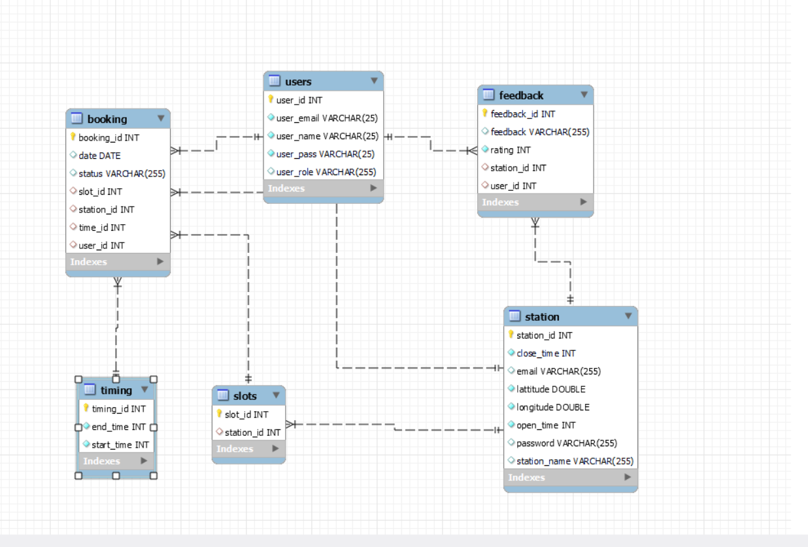
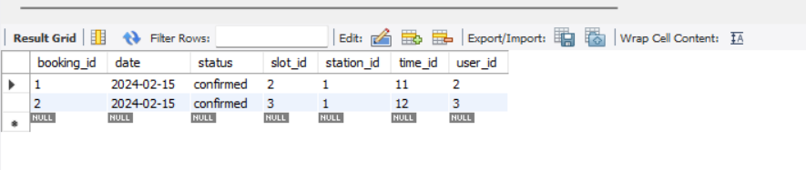
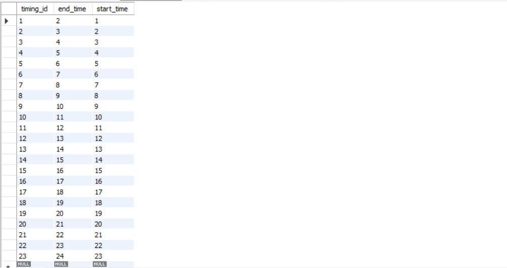
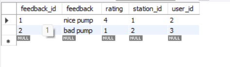
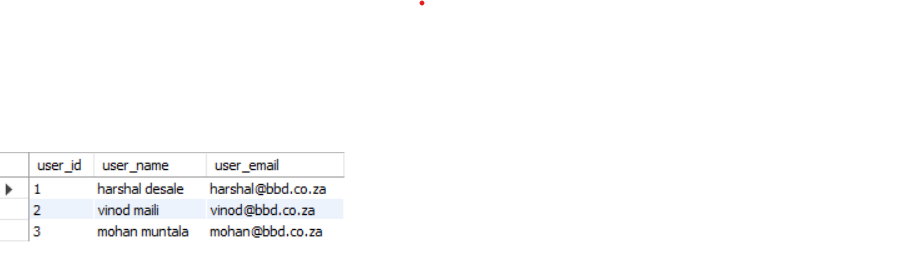
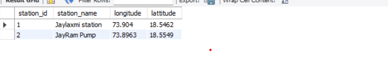

# EV_Station_Database_Design

The EV station project is focused on online booking for user on ev station.
## ER Diagram

#### Booking table

#### Time table

#### Feedback table

#### User view 

#### Station view 

### Procedure which show the bookings according to station

	DELIMITER //
	CREATE PROCEDURE ShowBookingsByStationID (IN stationID INT)
	BEGIN
    		SELECT *
    		FROM booking
    		WHERE station_id = stationID;
	END //

	DELIMITER ;

 
	CALL ShowBookingsByStationID(1); //calling the procedure

 ### Function for show working hours of station
 
	DELIMITER //
	CREATE FUNCTION working_hours(id INT) RETURNS INT DETERMINISTIC
	BEGIN
    		DECLARE ot INT;
    		DECLARE ct INT;
    		DECLARE output INT;
      
    		SELECT open_time INTO ot
    		FROM station
    		WHERE station_id = id; 
      
    		SELECT close_time INTO ct
    		FROM station
    		WHERE station_id = id;

    		SET output = ct - ot;

    	RETURN output;
	END //

  select working_hours(1) //calling function and pass the station id

#### Creating view for Station to show the details of user ie.(not giving access to attribute like password and role)
	create view show_user_details as
		select user_id,user_name,user_email from users;

	
	select * from show_user_details; //execute the view

#### Creating view for Station to show the details of user ie.(not giving access to attribute like password and role)
 	create view show_station_details as
		select station_id,station_name,station_longitude,station_lattitude from station;
	
 
 	select * from show_station_details; //execute the view

 
## Features

- Login & Auth
- Station Availability
- Book A appointment
- Find Station on Maps
- User Feedback On Station
- Station Creation And Slots Creation
- Booking Canclation

### Optional Features
- Payment Functionality
- Refund On Canclation
